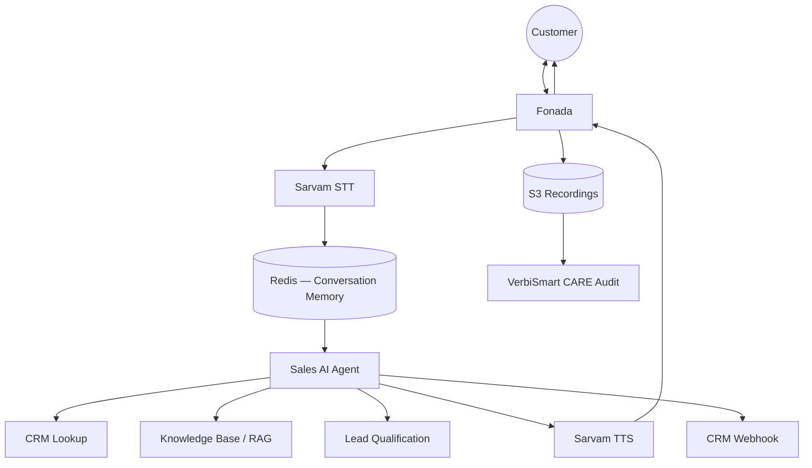

# VerbiLab AI Voicebot — Architecture & Platform Design

**Version:** 2.1 · **Date:** July 2026  
**Domain:** **Call BPO Sales only** (not education, real estate, or other verticals)  
**Current build:** **VerbiSmart CARE — sales call audit** (QA on human BPO agent recordings)  
**Planned next:** Sales VoiceBot (Fonada + AI agent) — reuses the same sales audit engine  
**Design philosophy (VoiceBot):** AI-native — LLM drives conversation; no drag-and-drop flow builder in V1  
**Prepared for:** Rakesh / VerbiLab leadership  
**Reference:** SuperBot walkthrough (`AIVOICEBOT*.mp4`) — dashboard UX reference only  
**Related:** [VerbiSmart CARE](PRODUCT_ARCHITECTURE.md) · [Ollama feasibility](OLLAMA_VOICEBOT_FEASIBILITY.md)

---

## 1. Product roadmap

### Now — VerbiSmart CARE (Call BPO Sales Audit) ✅

**This is what we are building today.**

Automated QA on **recorded sales calls** from **human BPO agents** — outbound/inbound telesales, lead qualification, product pitch, callback booking, close attempts.

| What it does | Detail |
|--------------|--------|
| Ingest | Upload or S3 URL — agent + customer audio |
| Transcribe | Sarvam STT + speaker diarization |
| Audit | `audit_mode=sales` — 24-pt rubric (`audit_modes/sales.py`) |
| Output | Score, disposition, conversion probability, coaching tips |
| CRM | LeadSquared sync (planned / in progress) |

**Not in current scope:** Collections QA, education counselling, real estate, or insurance-specific rubrics.

**Success metric:** Accurate sales QA scores, dispositions, and manager-ready coaching on every audited call.

### Later — Sales VoiceBot (planned)

After call audit is stable, we add an **AI calling agent** for the **same Call BPO Sales domain** — Fonada telephony, Sarvam STT/TTS, GPT conversation loop. Every bot call is audited by the **same CARE sales engine** already built for human agents.

| Layer | Status |
|-------|--------|
| Sales call audit (CARE) | **Building now** |
| Sales VoiceBot (Fonada + AI) | Planned — 3-week MVP after audit ship |
| Other audit modes / verticals | Out of scope until explicitly scoped |

**VoiceBot goal:** Convert leads → qualified → callback / demo / sale — for **call centre sales**, not vertical-specific bots.

---

## 2. Design decision: AI-native, not flow-based

SuperBot and Verloop use **node-based flow designers** (language → interest → city → branch → close). That works, but:

- Takes **months** to build and maintain
- Breaks when customers change scripts weekly
- Feels dated next to modern agentic products

**VerbiLab V1 approach:** Let the **LLM drive the conversation** using:

```
System Prompt  +  Knowledge Base  +  Business Rules  +  CRM data
```

The model naturally handles branching, objections, and qualification — no 300 flow nodes.

| SuperBot V1 | VerbiLab V1 |
|-------------|-------------|
| Drag-drop flow designer | **AI Prompt Studio** (system prompt + rules) |
| Hard-coded FAQ nodes | **Knowledge Base** (PDF / website / FAQ → RAG) |
| Static slot collection | **Lead qualification** via prompt + CRM lookup |
| Gen AI Settings tab | **AI Agent config** (tone, goals, max duration, slots) |

**Phase 2+ (enterprise only):** Optional visual flow builder for clients who insist on deterministic scripts. Not in MVP scope.

---

## 3. Runtime architecture (call path)

```
Customer
    │
 Fonada  (telephony webhook / media stream)
    │
 Sarvam STT  (streaming Hindi + English)
    │
 Conversation Memory  (Redis — turns, slots, intent, stage)
    │
 Sales AI Agent  (GPT-4.1 / Claude / Gemini / Sarvam)
    ├── CRM Lookup  (LeadSquared — name, history, lead score)
    ├── Knowledge Base  (RAG — PDFs, FAQs, brochures)
    └── Lead Qualification  (name, product, need, budget, intent)
    │
 Sarvam TTS  (Bulbul — voice selection per campaign)
    │
 Customer
    │
 [call ends]
    ├── S3 recording
    ├── CARE auto-audit  (audit_mode=sales)
    └── CRM webhook  (disposition, lead score, conversion %)
```



### 3.1 Single-turn loop

```
1. Fonada webhook → session start (campaign_id, lead_id, phone)
2. CRM lookup → inject lead context into system prompt
3. Loop:
   a. Sarvam STT (streaming) → transcript chunk
   b. Append to conversation memory (Redis)
   c. LLM: system prompt + KB retrieval + CRM context + history
   d. Anti-hallucination check (KB-only facts for product claims)
   e. Update slots (name, product interest, need, budget, intent, stage)
   f. Sarvam TTS → play to caller
4. End call → disposition + summary + lead score
5. Async: S3 upload → CARE ingest → QA score → CRM push
```

### 3.2 AWS deployment

| Component | Service | Notes |
|-----------|---------|-------|
| Voicebot API + orchestrator | EC2 (eu-north-1) | Same region as CARE RDS/S3 |
| Session memory | Redis (ElastiCache or EC2) | Turn history, slots, live-call state |
| Job queue | Celery + RabbitMQ (or Redis) | Outbound dialer, post-call CARE ingest |
| Dashboard | Next.js on Amplify / Vercel | `voice.verbilab.com` |
| Recordings | S3 | `voicebot/{campaign_id}/{call_id}.mp3` |
| Metadata | PostgreSQL (RDS) | Campaigns, calls, prompts, KB refs |
| Analytics | Metabase or Grafana | Funnels, cost, disposition trends |
| Audit | VerbiSmart CARE (existing) | `audit_mode=sales` on every bot call |

---

## 4. Platform modules

### Live today — VerbiSmart CARE (Sales Call Audit)

| Module | Status | Detail |
|--------|--------|--------|
| **Call ingest** | ✅ Building | Upload / URL / S3 — BPO sales recordings |
| **Transcription** | ✅ Building | Sarvam STT + diarization (agent vs customer) |
| **Sales QA report** | ✅ Building | Greeting, empathy, need discovery, product knowledge, closing |
| **Dispositions** | ✅ Building | `QUALIFIED`, `CALLBACK`, `DEMO_SCHEDULED`, `SALE_CLOSED`, etc. |
| **Dashboard** | ✅ Building | Reports, scores, flags — `care.verbilab.com` |
| **CRM (LeadSquared)** | 🔜 Planned | Push disposition, score, conversion % |

### Planned — Sales VoiceBot (after audit MVP)

#### 1. Campaigns

Create and run outbound/inbound **BPO sales** calling campaigns.

| Feature | Detail |
|---------|--------|
| Create campaign | Name, channel (inbound / outbound telesales) |
| Upload leads | CSV — phone, name, product, custom fields |
| Schedule calling | Time windows, max attempts, concurrency |
| Voice selection | Sarvam TTS voice (male / female, Hindi / English) |
| Languages | hi-IN, en-IN (auto-detect or fixed) |

#### 2. AI Agent (per campaign)

Configure the brain — replaces SuperBot's 300-node flow.

| Setting | Example |
|---------|---------|
| Role | "You are a sales agent for {{company_name}} BPO team." |
| Goal | Qualify lead and book callback / demo / close |
| Tone | Professional, warm, never argumentative |
| Max call duration | Per campaign (e.g. 4–6 minutes) |
| Business rules | Never argue; respect DND; gender-neutral Hindi |
| Objection handling | Prompt section + KB-backed responses |
| Slots to collect | Name, product interest, need, budget, timeline |
| End goal disposition | `DEMO_SCHEDULED` or `QUALIFIED` |

#### 3. Knowledge Base

Upload once — AI answers from documents, not hard-coded nodes.

| Source | Processing |
|--------|------------|
| PDFs | Chunk + embed → vector store |
| Website URL | Crawl + index |
| FAQs | Structured Q&A |
| Brochures | Same as PDF pipeline |

Injected into every LLM turn via RAG (`{{rag_context}}`).

#### 4. Call Dashboard

SuperBot-style overview, cleaner UX.

**Summary cards:**

| Total Calls | Connected | Interested | Follow Up | Demo Booked | Converted |
|-------------|-----------|------------|-----------|-------------|-----------|
| Avg Duration | Cost | | | | |

Per-campaign cards with disposition breakdown.

#### 5. Live Calls

Real-time ops view for active sessions.

| Column | Content |
|--------|---------|
| Customer | Phone / name |
| Status | Ringing / Connected / Ended |
| Current intent | low / medium / high |
| Current stage | Greeting / Discovery / Objection / Close |
| Transcript | Live STT stream |
| AI response | Last bot utterance |
| Latency | p95 turn time (ms) |

#### 6. Conversation History

Every completed call — full audit trail.

| Field | Detail |
|-------|--------|
| Transcript | Full dialogue (agent + customer) |
| Recording | S3 playback |
| Summary | LLM-generated 2–3 sentences |
| Disposition | `DEMO_SCHEDULED`, `CALLBACK`, etc. |
| Lead score | 0–100 |
| Conversion % | low / medium / high |
| Link | → CARE QA report |

#### 7. Analytics

Charts for sales managers.

- Daily calls · Connected % · Drop %
- Lead funnel (dialed → connected → interested → demo → converted)
- Sales funnel by campaign
- Top objections (extracted from transcripts)
- Average duration · Average cost per connected minute

#### 8. AI Prompt Studio ⭐ (competitive differentiator)

Where VerbiLab beats SuperBot's static Gen AI tab.

| Control | Purpose |
|---------|---------|
| System prompt | Role, goals, compliance rules |
| Knowledge base link | Which KB docs apply |
| Business rules | Max duration, mandatory disclosures |
| Objection handling | Dedicated prompt block |
| Fallback rules | "I don't know" → callback offer |
| Languages | hi-IN, en-IN rules |
| Temperature | Creativity vs consistency |
| Voice | Sarvam TTS voice ID |
| Model | GPT-4.1 / Claude / Gemini / Sarvam |

**Version control:** Save prompt v1, v2, v3 → **deploy with one click** to a campaign.

#### 9. CRM Integration

| CRM | Method |
|-----|--------|
| **LeadSquared** | Primary — disposition, lead score, conversion % (CARE scaffold exists) |
| Salesforce | REST API |
| HubSpot | Webhook |
| Zoho | Webhook |
| Freshsales | Webhook |
| Generic | Outbound webhook on call end |

---

## 5. Sales dispositions (aligned with CARE)

From `audit_modes/sales.py`:

| Disposition | Meaning |
|-------------|---------|
| `QUALIFIED` | BANT-style qualification met |
| `DEMO_SCHEDULED` | Meeting / demo booked |
| `SALE_CLOSED` | Conversion on call |
| `CALLBACK` | Customer asked to call later |
| `FOLLOW_UP` | Interested but not ready |
| `NOT_INTERESTED` | Declined |
| `NOT_QUALIFIED` | Does not fit ICP |
| `WRONG_NUMBER` | Bad contact |
| `LANGUAGE_ISSUE` | Language barrier |
| `NO_RESPONSE` | No answer / abandoned |
| `OTHER` | Catch-all |

Dashboard cards map to: **Interested** (`QUALIFIED`), **Follow Up**, **Demo Booked** (`DEMO_SCHEDULED`), **Converted** (`SALE_CLOSED`).

---

## 6. System prompt template — Call BPO Sales (VoiceBot, planned)

```text
You are a sales agent for {{company_name}} BPO team.
Channel: {{channel_type}} (outbound telesales | inbound sales line).
Languages: Hindi and English — match the caller.

## GOAL
Qualify the lead and secure next step: callback, demo, or sale.
Never argue. Maximum call time: {{max_duration_minutes}} minutes.

## CRITICAL RULES
1. GENDER-NEUTRAL HINDI — never assume gender.
2. ANTI-HALLUCINATION — only state facts from KNOWLEDGE_BASE.
3. COMPLIANCE — identify company + purpose. Respect DND. No false claims.
4. Current date/time: {{timestamp}}.

## CRM CONTEXT
{{crm_lead_context}}

## KNOWLEDGE_BASE
{{rag_context}}

## COLLECT (naturally, not as interrogation)
- name, product interest, need, budget, timeline
- intent: none | low | medium | high

## OBJECTION HANDLING
{{objection_rules}}

## END CALL
One disposition from: {{disposition_list}}
Conversion probability: low | medium | high
One-line CRM summary for LeadSquared.
```

---

## 7. What we learned from SuperBot (reference only)

| SuperBot module | VerbiLab equivalent | V1? |
|-----------------|---------------------|-----|
| Account Overview | Call Dashboard | ✅ |
| Performance / dispositions | Analytics | ✅ |
| Call List | Conversation History | ✅ |
| Gen AI Settings | **AI Prompt Studio** | ✅ |
| RAG / Knowledge Base | Knowledge Base module | ✅ |
| Design (flow builder) | **Deferred** — LLM replaces it | ❌ V2 |
| Verloop Homelane flow | Encoded in prompt + KB (BPO sales scripts) | ❌ V2 |

SuperBot disposition patterns (interested, callback, fees enquiry) map to our **BPO sales** dispositions in Section 5.

---

## 8. VerbiSmart CARE — sales call audit (current product)

| Step | Action |
|------|--------|
| Upload | Agent records BPO sales call → CARE ingest |
| Transcribe | Sarvam STT + diarization (agent vs customer) |
| QA | `audit_mode=sales` — greeting, empathy, need discovery, product knowledge, closing |
| Output | Score, grade, disposition, conversion probability, coaching tip |
| CRM | LeadSquared push (planned) |

**Pitch today:** "Automated QA on every **BPO sales call** — same rubric managers use, at scale."

**When VoiceBot ships:** Bot calls use the **identical** audit pipeline — no second QA engine to build.

---

## 9. Tech stack

| Layer | Choice | Notes |
|-------|--------|-------|
| **Frontend (CARE)** | React + Amplify | `care.verbilab.com` — **building now** |
| **Frontend (VoiceBot)** | Next.js | `voice.verbilab.com` — planned |
| **Backend** | FastAPI (Python) | Orchestrator, webhooks, campaign API |
| **Database** | PostgreSQL (RDS) | Shared or separate schema from CARE |
| **Cache** | Redis | Conversation memory, live-call state |
| **Queue** | Celery + RabbitMQ | Outbound dialer, async CARE ingest |
| **Storage** | AWS S3 | Recordings + KB documents |
| **Speech STT** | Sarvam (streaming) | Hindi + English |
| **Speech TTS** | Sarvam Bulbul | Per-campaign voice |
| **LLM** | GPT-4.1 / Claude / Gemini | Primary; Sarvam/Ollama for cost path ([benchmark](OLLAMA_VOICEBOT_FEASIBILITY.md)) |
| **Telephony** | **Fonada** | VoiceBot telephony provider (per product decision) |
| **Analytics** | Metabase or Grafana | Funnels, cost dashboards |
| **QA** | VerbiSmart CARE | Existing — no rebuild |

CARE dashboard is the **current product**. VoiceBot is a **planned** product surface on Next.js.

---

## 10. Delivery timeline

### Now — VerbiSmart CARE (Call BPO Sales Audit)

| Focus | Deliverable |
|-------|-------------|
| Ingest + Sarvam pipeline | Upload / URL ingest, diarization, transcription |
| Sales QA engine | `audit_mode=sales` scoring, dispositions, coaching |
| Dashboard | Reports, scores, call detail — `care.verbilab.com` |
| Production | EC2 + RDS + Amplify (deploy in progress) |
| CRM | LeadSquared sync |

### Planned — Sales VoiceBot (3-week MVP, after audit stable)

| Week | Focus | Deliverables |
|------|-------|--------------|
| **Week 1** | Runtime | FastAPI · Fonada webhook · Sarvam STT/TTS · GPT loop · Redis |
| **Week 2** | Platform | LeadSquared · Call Dashboard · History · Analytics |
| **Week 3** | Intelligence | Prompt Studio · Knowledge Base · bot calls → CARE audit · deploy MVP |

**Post-MVP:** Visual flow designer (enterprise) · additional CRM connectors · model cost benchmarks

---

## 11. Cost-effective model testing (Santosh ask)

Side-by-side on **same 50 sales dialog scripts**:

| Model | Quality | Latency (p95) | Cost / 1000 min |
|-------|---------|---------------|-----------------|
| GPT-4.1 / Claude | Baseline quality | TBD | API cost TBD |
| Sarvam saaras + 30B | India-native | TBD | ₹~0.50/min |
| Ollama Qwen2.5 7B (L4) | Cost path | TBD | GPU ₹~0.21/min |

Deliverable: `voicebot-benchmark/report.md` with production recommendation.

---

## 12. Immediate next steps

1. **Ship sales call audit (CARE)** — ingest, Sarvam, sales QA, dashboard on production
2. **LeadSquared** — wire disposition + score push from audited calls
3. **VoiceBot** — start Week 1 spike (Fonada + GPT loop) only after audit MVP is demo-ready
4. **Share architecture doc** with Rakesh — current = audit; planned = VoiceBot

---

## 13. Reference video index

| File | Takeaway for VerbiLab |
|------|----------------------|
| `AIVOICEBOT.mp4` | Dashboard cards, campaign list — **build this** |
| `AIVOICEBOT_2.mp4` | Analytics, disposition breakdown, Gen AI Settings — **→ Prompt Studio** |
| `AIVOICEBOT_3.mp4` | Outbound sales flow patterns — encode in prompt + KB, not nodes |
| `ai voicebot demo.mp4` | Additional telephony UX patterns |

---

*Document owner: VerbiLab Engineering · Siddhanth / Santosh*
