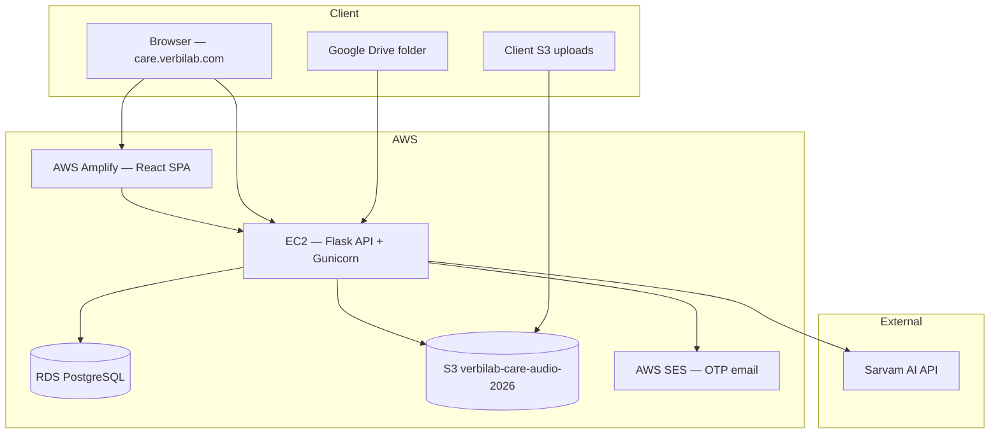

# VerbiSmart (Verbilab CARE) — Product & Infrastructure Document

**Version:** 1.0 · **Last updated:** July 2026  
**Audience:** Client stakeholders (Fibe / finance partners), Verbilab engineering, QA  
**Production URLs:** Dashboard `https://care.verbilab.com` · API `https://api.care.verbilab.com`

---

## 1. Product summary

**VerbiSmart** is an AI-powered **call audit and conduct-risk platform** for **Collections QA** and **Sales QA**. It ingests call recordings, transcribes and diarizes them, scores agent performance against a configurable rubric, and surfaces KPIs, compliance flags, and coaching insights on a web dashboard.

| Capability | Description |
|------------|-------------|
| Call ingestion | Local upload, Google Drive/URL, Amazon S3 URI, dialer webhooks (planned) |
| Speech pipeline | Sarvam Saaras v3 — batch STT + speaker diarization |
| Scoring | Rules engine (20-pt Collections / 24-pt Sales) + optional Sarvam LLM |
| Outputs | Score, grade, disposition, PTP detection, compliance flags, transcript |
| Users | QA managers, supervisors, super admins (JWT + optional email OTP) |

---

## 2. High-level architecture



---

## 3. Technology stack

### 3.1 Frontend — AWS Amplify

| Item | Detail |
|------|--------|
| **Framework** | React 18 + Vite |
| **Hosting** | AWS Amplify (`amplify.yml` at repo root) |
| **Domain** | `care.verbilab.com` |
| **Build env** | `VITE_API_URL=https://api.care.verbilab.com` |
| **Auth** | JWT stored in browser; API calls include `Authorization: Bearer` |

The dashboard is a static SPA. All business logic and secrets live on the backend EC2 instance.

### 3.2 Backend — AWS EC2

| Item | Detail |
|------|--------|
| **Runtime** | Python 3.11+, Flask, Gunicorn |
| **Recommended region** | `eu-north-1` (Stockholm) — same region as S3 bucket |
| **Domain** | `api.care.verbilab.com` (nginx + optional TLS) |
| **Entry** | `care-backend/app.py` |
| **Pipeline** | `care-backend/processor.py` |
| **Deploy** | `care-backend/deploy/redeploy-ec2.sh` after `git pull` |

**Key environment variables (EC2 `.env`):**

| Variable | Purpose |
|----------|---------|
| `DATABASE_URL` | RDS PostgreSQL connection string |
| `JWT_SECRET` | Session signing |
| `SARVAM_API_KEY` | Sarvam STT + optional LLM scoring |
| `CARE_USE_DIARIZATION=1` | Audio diarization via Sarvam batch API |
| `AWS_ACCESS_KEY_ID` / `AWS_SECRET_ACCESS_KEY` | S3 + SES |
| `S3_AUDIO_REGION=eu-north-1` | **Required** — bucket is not in us-east-1 |
| `S3_BUCKET=verbilab-care-audio-2026` | Audio archive + S3 ingest |
| `PUBLIC_API_URL` | `https://api.care.verbilab.com` |
| `CARE_CORS_ORIGINS` | `https://care.verbilab.com` |

Health check: `GET https://api.care.verbilab.com/api/health`

### 3.3 Database — AWS RDS (PostgreSQL)

| Item | Detail |
|------|--------|
| **Engine** | PostgreSQL 15+ |
| **Usage** | Calls, users, orgs, scores, transcripts, audit metadata |
| **Local dev** | SQLite (`care.db`) when `DATABASE_URL` is unset |
| **ORM layer** | `care-backend/database.py` |

Tables include `calls`, `users`, `drive_configs`, with JSON columns for analysis payloads.

### 3.4 Object storage — AWS S3

| Item | Detail |
|------|--------|
| **Bucket** | `verbilab-care-audio-2026` |
| **Region** | `eu-north-1` |
| **Prefixes** | `calls/{call_id}/` (archive after processing), `audio/` (client ingest) |
| **IAM user** | `verbilab-care` |

**Required IAM permissions:**

```json
{
  "Version": "2012-10-17",
  "Statement": [{
    "Effect": "Allow",
    "Action": ["s3:GetObject", "s3:PutObject", "s3:HeadObject", "s3:ListBucket"],
    "Resource": [
      "arn:aws:s3:::verbilab-care-audio-2026",
      "arn:aws:s3:::verbilab-care-audio-2026/*"
    ]
  }]
}
```

**Common S3 errors:**

| Error | Cause | Fix |
|-------|-------|-----|
| `InvalidAccessKeyId` | Wrong or rotated AWS keys on EC2 | Update `.env`, restart API |
| `403 Forbidden` | Region mismatch or missing IAM policy | Set `S3_AUDIO_REGION=eu-north-1`; apply policy above |
| Processing failed on S3 ingest | Object at `s3://bucket/audio/...` not readable | Verify key exists; check IAM |

Playback is **proxied through the API** (`GET /api/v1/calls/{id}/audio`) so browsers never need direct S3 CORS.

### 3.5 AI — Sarvam AI

| Item | Detail |
|------|--------|
| **STT model** | `saaras:v3` (batch speech-to-text-translate) |
| **Diarization** | `with_diarization=True`, 2 speakers default |
| **Scoring LLM** | `sarvam-30b` (optional; rules-only mode for dev) |
| **Module** | `care-backend/diarization.py`, `processor.py` |
| **Cost (indicative)** | ~₹0.50/min all-in for STT + diarization (Sarvam billing) |

**Pipeline steps per call:**

1. Fetch audio (local upload / S3 / URL / Drive)
2. Sarvam batch job — diarized English transcript with speaker IDs
3. Map `speaker_1` / `speaker_2` → Agent / Customer (one decision per call)
4. Rules + optional LLM scoring → score / disposition / flags
5. Archive audio to S3; store results in RDS

---

## 4. Call processing flow

```
Upload / S3 / Drive / URL
        │
        ▼
   Queue (status: queued)
        │
        ▼
   Fetch audio ──► ffmpeg normalize
        │
        ▼
   Sarvam Saaras v3 (diarization ON)
        │
        ▼
   Speaker role mapping (Agent / Customer)
        │
        ▼
   Scoring (scoring_rules.py + optional Sarvam LLM)
        │
        ▼
   Persist to RDS + S3 archive
        │
        ▼
   Dashboard (processed)
```

**Parallel processing:** `CARE_MAX_PARALLEL_PROCESSING=4` (recommended for 20–30 call batches).

---

## 5. Security & credentials

| Secret | Where stored | Visible in UI? |
|--------|--------------|----------------|
| `SARVAM_API_KEY` | EC2 `.env` only | **No** — never exposed in dashboard |
| AWS keys | EC2 `.env` only | **No** |
| JWT | Browser localStorage | Session token only |
| User passwords | Hashed in RDS | N/A (OTP login supported) |

Integration status is available at `GET /api/v1/integrations/status` (authenticated) — returns connected/disconnected only, no key material.

---

## 6. Dashboard modules

| Page | Purpose |
|------|---------|
| Dashboard | KPIs, score distribution, agent performance, AI detections |
| KPI Tracker | Agent / Customer-Loan / Portfolio metrics (PRD-aligned) |
| Upload | Local, Drive/URL, S3 ingest |
| Reports | Call list, filters, export |
| Settings | Org profile, scoring thresholds, integrations status |
| Users | Admin user management |

---

## 7. Deployment checklist

### Backend (EC2)

```bash
cd ~/Verbilab_CARE/care-backend
cp deploy/.env.example .env   # fill all secrets
bash deploy/ec2-setup-native.sh
curl https://api.care.verbilab.com/api/health
# Expect: db_ok=true, s3_ok=true, stt_configured=true
```

### Frontend (Amplify)

- Connect GitHub repo branch `main`
- App root: `care-dashboard`
- Env: `VITE_API_URL=https://api.care.verbilab.com`
- Custom domain: `care.verbilab.com`

### Post-deploy verification

1. Upload one `.mp3` via Local Upload → status **processed**
2. Upload via S3 tab with `s3://verbilab-care-audio-2026/audio/sample.mp3` → **processed**
3. Open call detail → audio plays
4. Settings → Integrations → Amazon S3 shows **connected**

---

## 8. Operational contacts & repos

| Resource | Location |
|----------|----------|
| Source code | GitHub `Verbilab_CARE` |
| Backend deploy docs | `care-backend/deploy/EC2_CHECKLIST.md` |
| Knowledge base | `docs/KNOWLEDGE_BASE.md` |
| Dry-run script | `care-backend/scripts/dry_run_bulk.py` |

---

## 9. Demo readiness (Fibe)

- **STT:** Sarvam only (production path)
- **Bulk:** 20–30 calls with `CARE_MAX_PARALLEL_PROCESSING=4`
- **Pre-demo:** Purge test calls; verify S3 + Sarvam on EC2 health endpoint
- **Known requirement:** Valid AWS IAM keys on EC2 for S3 ingest/playback archive

---

*Document owner: Verbilab Engineering · For questions contact the Verbilab CARE team.*
